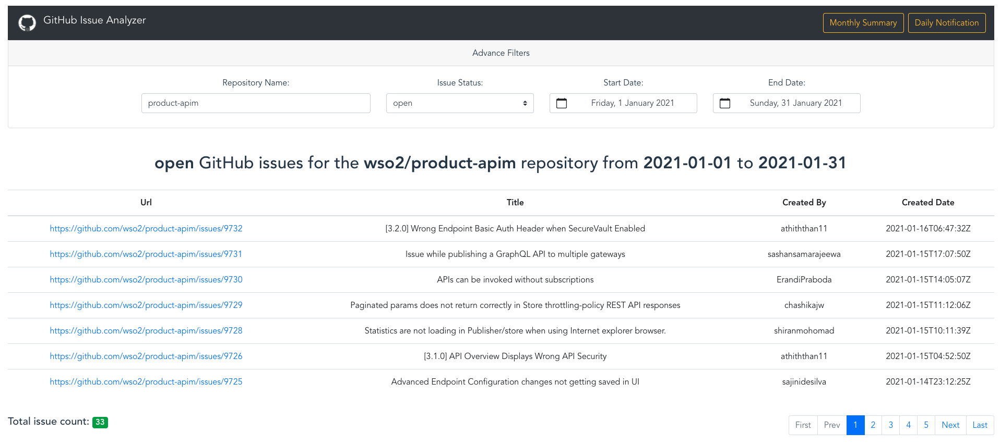
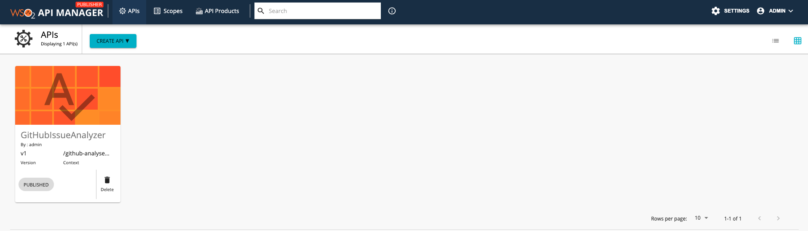
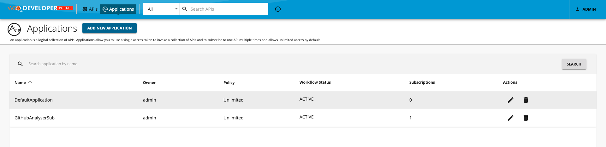
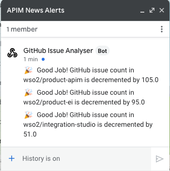
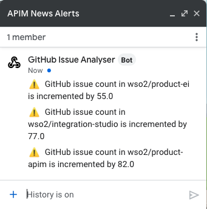
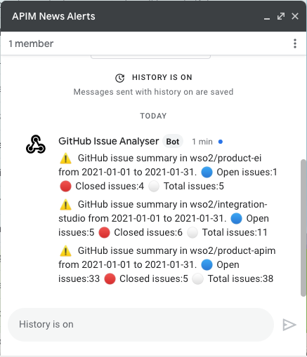
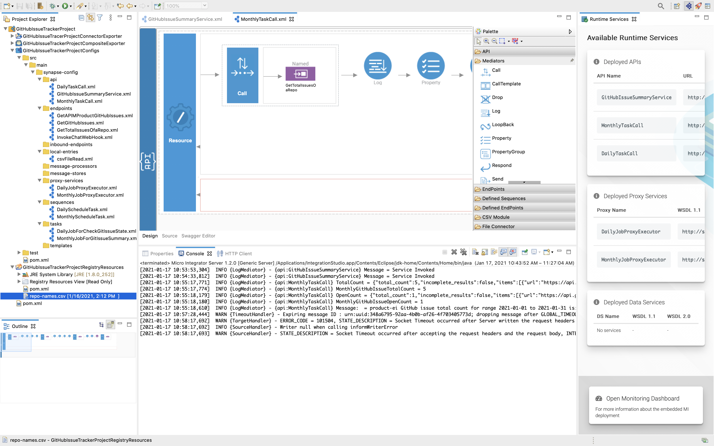

# GitHub Issue Analyser

GitHub Issue Analyzer is a VueJS based web application based that has been integrated with WSO2 API Manager and WSO2 Micro Integrator. 



It has following features.

- List open/closed issues for any wso2 organisation repository.
- List open/closed issues for any wso2 organisation repository in a date range.
- Detailed view of isssues with a pagination.
- Daily schedule task to alert increase or decrease count of issues for defined wso2 organisation repository.
- Monthly schedule task to alert sumamry of defined wso2 organisation repository.
- Integrate chat bots.
- Application uses "grant_type=client_credentials" to auth with API Manager (admin/admin priviledges).

## Setup and Install
Please follow the steps below to setup in a VM-based environment.

### Create a Google Chat Bot
1. Create a chat room called **APIM News Alerts**
2. Create a bot weebhook. Please refer the [documentation](https://developers.google.com/hangouts/chat/how-tos/webhooks#define_an_incoming_webhook).
3. Copy and save the webhook URL. 

### Setup Micro Integrator Backend
4. Export bot webhook url as follows.
    ```
    export CHAT_WEBHOOK=<COPIED WEBHOOK URL>
    ```
5. Copy the `<PROJECT_ROOT>/mi_application/CApp/GitHubIssueTrackerProjectCompositeExporter_1.0.0.car` carbon application into the `<MI_HOME>/repository/deployments/server/carbonapps/` directory.
6. Download and start the [Micro Integrator](https://github.com/wso2/micro-integrator/releases/tag/v1.2.0) server (tested in MI-1.2.0 distribution).
    ```
    ./<MI_HOME>/bin/micro-integrator.sh
    ```

### Setup API Manager server
7. Download and start the [API Manager](https://github.com/wso2/product-apim/releases/tag/v3.2.0) server (tested in APIM-3.2.0 distribution).
    ```
    ./<APIM_HOME>/bin/wso2-server.sh
    ```
8. Download `apictl-3.2.0` from the [release](https://github.com/wso2/product-apim-tooling/releases/tag/v3.2.0) and navigate to its root direcotry.
9. Import `<PROJECT_ROOT>/apim_application/GitHubIssueAnalyzer_v1.zip` API archive using the apictl follwoing command.
    ```
    ./apictl import-api --file <ROOT>/apim_application/GitHubIssueAnalyzer_v1.zip --environment env -k
    ```
    

10. Import `<PROJECT_ROOT>/apim_application/admin_GitHubAnalyserSub.zip` Application archive using the apictl follwoing command.
    ```
    ./apictl import-app --file <ROOT>/apim_application/admin_GitHubAnalyserSub.zip --environment env -k
    ``` 
    
11. To deal with CORS issues, enabling CORS for Token API. Add the following api handler to the `_TokenAPI_.xml` file located in the `<APIM_HOME>/repository/deployment/server/synapse-configs/default/api` directory.
    ```    
    <handler class="org.wso2.carbon.apimgt.gateway.handlers.security.CORSRequestHandler">
            <property name="apiImplementationType" value="ENDPOINT"/>
            <property name="allowHeaders" value="authorization,Access-Control-Allow-Origin,Content-Type,SOAPAction"/>
            <property name="allowedOrigins" value="*"/>
            <property name="allowedMethods" value="GET,PUT,POST,DELETE,PATCH,OPTIONS"/>
    </handler>
    ```
### Setup VueJs Web Application
12. Navigate to the `<PROJECT_ROOT>/node_application` directory.
13. Install web application using following commands.
    ```
    npm install -g @vue/cli
    npm install
    ```
14. Start the web application.
    ```
    npm run serve
    ```
15. Open [http://localhost:8080](http://localhost:8080) to view it in the browser.

16. Use advance filter option to get issue details of WSO2 repositories.

## Capabilities
- Default CApp contains two schedule tasks (cron jobs)      
    - **DailyJobForCheckGitIssueState** which runs at 01:00:00am every day to check the status of defined wso2 repositories. Job sends a message to configured chat bot including the daily details.
    
    

    
    
    - **MonthlyJobForGitIssueSummary** which runs at 00:00:00am, on the last day of the month, every month, to get the monthly sumamry of the defined wso2 repositories. The job can detect the start date and end date of the current month through the logic itself. Job sends a message to configured chat bot including the monthly details.

    

- In the web UI, there are two buttons called **Monthly Sumamry** and **Daily Notifications** on the navbar to trigger the both daily and monthly schedule tasks manually (will be useful for testing purposes). 

- Default CApp contains **product-apim** and **product-ei** repositories to work with the schedule tasks. If you want to add more wso2 repositories please add those reponames to the `<MI_HOME>/registry/governance/custom/repo-names.csv` file in the file based registry after staring the MI server.   

- For **DailyJobForCheckGitIssueState** task, previous GitHub issue count for the defined repositories can be found in `<MI_HOME>/registry/config/resource` directory (first time count will be considered as 0). You can change these values and test this daily job how works for increment and decrement by 50 use cases (will be useful for testing purposes).

## Development
[Integration Studio 7.2.0](https://github.com/wso2/integration-studio/releases/tag/v7.2.0) release used to implement the business logics of the application.



## Note
Sample screenshots of the created application can be found in the **images** directory.

- **<PROJECT_ROOT>** - Root directory of the GitHub Issue Analyser application
- **<MI_HOME>** - Root directory of the Micro Integrator runtime
- **<APIM_HOME>** - Root directory of the API Manager runtime
